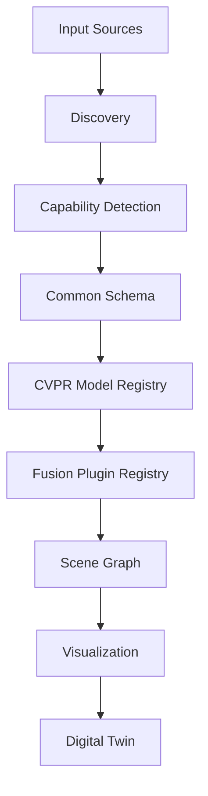

# Universal-CV-Adapter

Universal-CV-Adapter is a production-grade scaffold for integrating heterogeneous computer vision
systems (SkellyCam, ROS2, GStreamer, CVPR repositories, and future research models) through a
thin adapter architecture. [See system architecture blueprint here.](https://drive.google.com/file/d/1xV0bIm831s-ngtiAbyosJEgINP_Uj0Ji/view?usp=drive_link)

## Repository Intent

- Production-oriented integration scaffold for heterogeneous CV systems
- Config-driven runtime assembly with deterministic planning and workflow graph compilation
- Strongly typed contracts across discovery, capabilities, schemas, registries, fusion, and orchestration
- Contract-hardening focus: fail-fast validation, explicit boundary errors, and CI guardrails
- No heavy CV algorithm implementation in-repo; adapters expose stable interfaces for external models/plugins

## Core Flow



## Quick Start

```bash
python -m pip install -e .[dev]
make lint
make test
make typecheck
```

## Extension Notes

- Implement a new model by subclassing `registry.cvpr_model.CVPRModel`.
- Implement new sensor sources via `adapters.sensor_adapter.SensorAdapter`.
- Add fusion strategies by subclassing `fusion.base.FusionPlugin`.

## TODO

- TODO: Expand boundary contract tests for additional plugin/model lifecycle edge cases.
- TODO: Add integration checks for multi-source runtime paths (SkellyCam + URI + IMU) in CI.
- TODO: Add architecture decision records (ADRs) for deterministic planning and contract policy.
- TODO: Add deployment-specific adapter runbooks (ROS2/GStreamer) with troubleshooting guidance.
