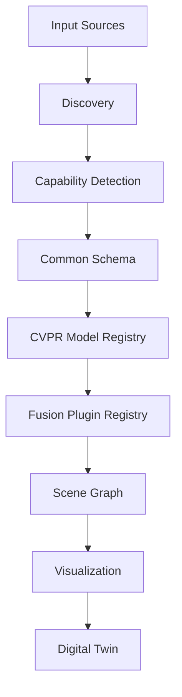

# Universal-CV-Adapter

Universal-CV-Adapter is a production-grade scaffold for integrating heterogeneous computer vision
systems (SkellyCam, ROS2, GStreamer, CVPR repositories, and future research models) through a
thin adapter architecture. [See system architecture blueprint here.](https://drive.google.com/file/d/1xV0bIm831s-ngtiAbyosJEgINP_Uj0Ji/view?usp=drive_link)

## Repository Intent

- Architecture and scaffolding only
- No model inference logic
- No algorithmic CV implementation
- Strongly typed interfaces for model, fusion, discovery, orchestration, and visualization layers

## Core Flow



## Quick Start

```bash
python -m pip install -e .[dev]
make lint
make test
make typecheck
```

## Extension Notes

- Implement a new model by subclassing `registry.cvpr_model.CVPRModel`.
- Implement new sensor sources via `adapters.sensor_adapter.SensorAdapter`.
- Add fusion strategies by subclassing `fusion.base.FusionPlugin`.

## TODO

- TODO: Implement runtime wiring in orchestration modules.
- TODO: Implement adapter runtime logic per deployment environment.
