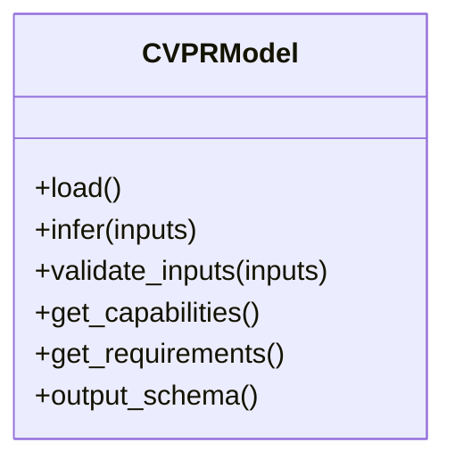

# Adapter Guide

Adapters convert external source/model APIs into Universal-CV-Adapter contracts.

```mermaid
classDiagram
    class CVPRModel {
      +load()
      +infer(inputs)
      +validate_inputs(inputs)
      +get_capabilities()
      +get_requirements()
      +output_schema()
    }
```

## TODO

- TODO: Add per-framework adapter checklists (PyTorch, ONNX, TensorRT).
