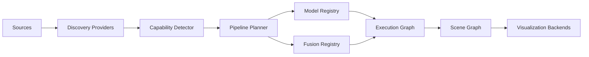

# Architecture

Universal-CV-Adapter uses a composable, adapter-first architecture where each research model is
integrated through a thin plugin layer.

## TODO

- TODO: Add runtime sequence and fault-handling diagrams.
