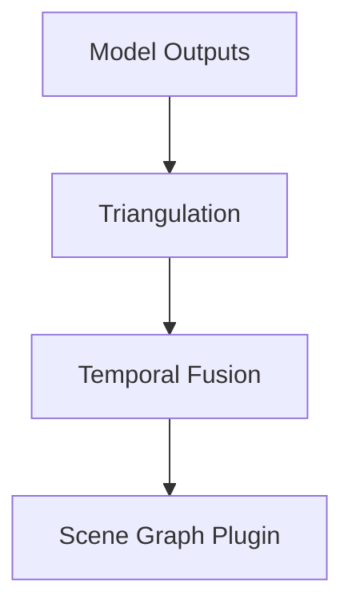

# Fusion Guide

Fusion plugins consume normalized intermediate outputs and produce higher-level scene artifacts.

```mermaid
flowchart TD
    A[Model Outputs] --> B[Triangulation]
    B --> C[Temporal Fusion]
    C --> D[Scene Graph Plugin]
```

## TODO

- TODO: Add contract examples for each fusion plugin type.
