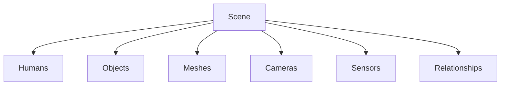

# Scene Graph

The scene graph is the canonical digital twin representation shared across the platform.

```mermaid
graph TD
    Scene --> Humans
    Scene --> Objects
    Scene --> Meshes
    Scene --> Cameras
    Scene --> Sensors
    Scene --> Relationships
```

## TODO

- TODO: Add relationship ontology and versioning guidance.
